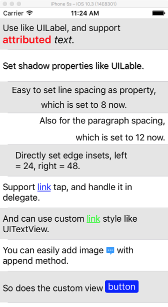

# GSAttributedLabel

A label based on TextKit, which can set paragraph styles with properties, supporting attributes, link interaction, image attachment and custom view.

Language: [English](./README.md) [简体中文](./README.chs.md)

## Screenshot

## Document

It's easy to known how to use through header file. This is also a simple sample for how to use NSLayoutManager.

For attributed text generation, see [GSMarkupParser](https://github.com/geansea/GSMarkupParser).
